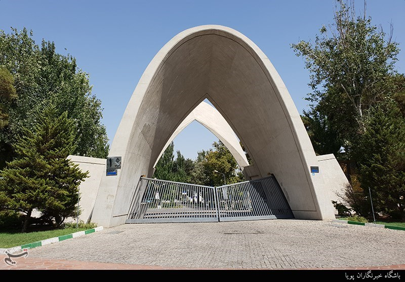

{:style="text-align:right"}
{:style="text-align:justify"}

# مدیریت زمان و برنامه ریزی 
طی صحبت هایی که با خانم ها امیری ،آذری،فصاحت و مهرابی داشتم ؛
: نکات مهم و مفیدی را از تجربیاتشان برای مدیریت زمان و برنامه ریزی در دانشگاه عنوان کردند که به برخی از آن ها می پردازیم

## 1. مطالب درسی رو هم انباشته نشود
ممکن نیست که در طول ترم درس نخوانید بعد شب امتحان تازه یاد کتاب و جزوه کنید و بعد هم انتظار موفقیت در امتحان را داشته باشید. درس های دانشگاه مثل درس های دبیرستان نیست که حجم کمتری داشته باشد. مطالب حجیم و سنگین هستند. پس بهتر است که در طول ترم با یک برنامه صحیح خوانده شوند

## 2. همیشه در کلاس درس فعال باشید 
موفق ها در کلاس همیشه فعال بوده و در بحث های گروهی شرکت می کنند. اگر مطلبی را متوجه نشده اند مرتبا از استاد سوال می پرسند تا مطالب را در همان کلاس یاد بگیرند. حتما در هر مبحثی که استاد تدریس می کند خوب گوش کنید، جزوه بنویسید و سوال بپرسید

## 3. مهارت جزوه نویسی
سبک مطالعه در دوران مدرسه با دانشگاه متفاوت است. در دانشگاه دانشجو باید بتواند یک جزوه کامل را در نهایت در 70 صفحه بنویسد. دانشجویان موفق بهترین و کاملترین جزوه های دانشگاهی را دارند

## 4. مشورت با سال بالایی های درسخوان
ستفاده درست از تجربیات دیگران در هر جا و هرسن و سالی به شما  کمک می کند تا تصمیم و عملکرد معقول تر و مطلوب تری داشته باشید، دانشگاه هم از این قاعده مستثنی نیست. قبل از انتخاب واحد در هر ترم حتما با سال بالایی های درسخوان مشورت کنید ممکن است یک درس با چند استاد معرفی شود و آن ها بتوانند اساتید بهتر را پیشنهاد بدهند و یا به شما پیشنهاد برخی واحدها را زودتر و برخی را دیرتر بردارید و یا در ترم های کوتاه زوج درس هایی خاص را انتخاب کنید و در ترم های فرد برخی دیگر را

## 5.از الان به فکر ارشد باشید 
از الان بگویم که چند سال دیگر چشم برهم می زنید و می بینید در حالی که هنوز از دویدن در ماراتن کنکور کارشناسی نفس نفس می زنید باید آماده کنکوری تازه شوید، کتاب تست، کلاس کنکور، کنکورهای آزمایشی، استرس روز کنکور،نتایج، و.. دوباره نقطه سرخط در حالی که اگر یک دانشجوی درس خوان بمانید می توانید بدون کنکور به تحصیل در مقاطع بالاتر آموزش عالی ادامه دهید
 
 
بر اساس قانون جذب استعدا های درخشان در مقطع کارشناسی اگر شما جز 10 درصد اول معدل اولی های کلاس باشید می توانید با معدل به عنوان دانشجوی ارشد پذیرفته شوید و گاهی می توانید با ارسال کارنامه خود حتی در دانشگاه های دیگر نیز بدون کنکور وارد مقطع ارشد شوید
 
 
علاوه بر این اگر شما موفق شوید واحدهای لیسانس را در 6 ترم یعنی 3 سال بگذرانید در حالی که معدل کل تان از معدل میانگین هم ورودی هایتان کمتر نباشد(عموما این میانگین خیلی بالا نیست) می توانید بدون تحمل مشقات کنکوری دیگر دانشجوی کارشناسی ارشد شوید. برای اتمام دوره کارشناسی در 3 سال باید هر ترم حدود 24 واحد درس را پاس کنید و برای داشتن این امکان باید معدل تان را بالای 17 نگه دارید

## 6. وقت خود راتقسیم کنید
برای مطالبی که یادگیری آنها زیاد به حافظه متکی است وقت مطالعه را تقسیم کنید ( مثلا شبی یک ساعت در 5شب بهتر از 5 ساعت در یک شب است )
 پیش بینی میزان مطالبی که قصد مطالعه آن را دارید و در نظر گرفتن زمان معین برای آن، تمرکز شما را افزایش مي­دهد

## 7. برنامه های خود را بنویسید 
اولین قدم برای برنامه ریزی برنامه درسی این است که همه موضوعات و موارد مورد نیاز برای تحصیل را فهرست کنید
تعهدات خود را و چیزهایی که باید انجام دهید را بر روی کاغذ بنویسید
این به شما در ایده ها و در مورد آنچه که باید انجام دهید، کمک خواهد کرد
اگر امتحان دارید، آنها را به عنوان یک اولویت مطالعه کنید

## 8. تفریح داشته باشید 
حتما قسمتی از وقت خودتان را به داشتن تفریح و استراحت اختصاص دهید 

---
