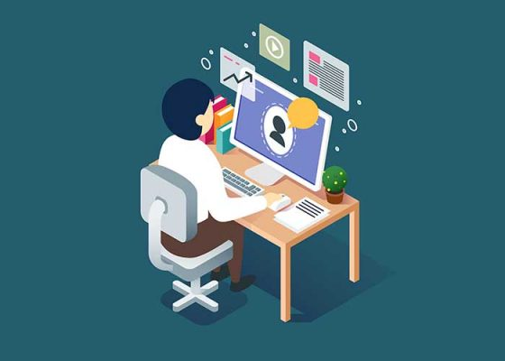

تجربیات هر فرد، بالاتر از هر دانشی است که می توان در دانشگاه ها و مراکز آموزشی به دست آورد. تجربه به ما می گوید، دانشی که یاد گرفته ایم، چه قدر و چه طور به کار می آید. تجربیات در حقیقت، میزان کارآمدی هر طرز فکر را سنجیده اند و در قالب یک دانش جدید به دست آمده اند. اگرچه تحصیلات دانشگاهی برای ورود به بازار کار و پیشرفت، نیاز اولیه به حساب می آیند، اما تا این دانش را به کار نگرفته باشیم، از کمبودها یا توانایی هایمان آگاهی به دست نمی آوریم. درست در این زمان است که نیاز به یک فرد   باتجربه داریم. کسی که بتواند کم و کاستی های واقعی‌مان را به ما گوشزد کند تا در مسیر درست قرار بگیریم
به همین دلیل با دو نفر از فارغ التحصیلان دانشگاه علم و صنعت مصاحبه ای امجام دادم تا بتوانم از تجربیات ارزشمند آن ها 
در این مسیر استفاده کنم .
ابتدا به معرفی هر کدام می پردازم :

## خانم مینا سمیعی زاده 
فارغ التحصیل کارشناسی رشته مهندسی کامپیوتر و کارشناسی ارشد رشته هوش مصنوعی دانشگاه علم و صنعت و در حال حاضر دانشجو دکترا 
 در دانشگاهی در آمریکا می باشند
ایشان به مدت دو سال هم در شرکتی تحقیقاتی در تهران کار می کردند 

## خانم سمانه رضوی
فارغ التحصیل کارشناسی رشته مهندسی کامپیوتر از دانشگاه علم و صنعت و در حال حاضر دانشجو کارشناسی ارشد هوش مصنوعی دانشگاه علم و صنعت می باشند ، لازم به ذکر است که ایشان ارشد مستقیم بوده اند و بدون آزمون کارشناسی ارشد موفق به پذیرش در دانشگاه شده اند . 

# حال به بررسی تجربیات و مطالب عنوان شده در مصاحبه می پردازیم :

## 1.تعیین اهداف 
اگر شما هدف مهاجرت تحصیلی و بورسیه شدن و یا تحصیل در مقطع ارشد توی یک دانشگاه خوب دارین، باید همه تمرکز و  وقت خودتان را روی درس خواندن بگذارید و سعی کنید معدل خودتان را بالا ببرید .ولی اگر می خواهید کار کردن را یاد بگیرید بهتر است بعد از  گذراندن چند ترم مشغول به کار شوید البته دانشجویانی هستند که از ترم های پنجم و ششم مشغول به کار پاره وقت می شوند و هم تجربه کار کردن را یاد می گیرند و هم می توانند با برنامه ریزی مناسب درس های خود را خوب مطالعه کنند و معدل خود را حفظ کنند .البته منظور این نیست که کارکردن خوب نیست اتفاق باید حتما تجربه کار کردن حتی بدون حقوق را داشت اما اگر هدف شما داشتن معدلی بالاست نباید کار کردن الویت اول شما شود . 

## 2. درس‌های دانشگاهی را بسیار خوب بخوانید
نخست باید درس های دانشگاهی را خوب بخونید ولی نه فقط برای اینکه آن ها را پاس کنید بلکه آن ها را یاد بگیرید مخصوصا درس های پایه ای مانند مبانی کامپیوتر و برنامه نویسی پیشرفته را خوب یاد گرفت چون پایه و پیش نیاز بسیاری از درس های دیگر در ترم های بالاتر می شود . درخصوص درس های علوم پایه هم سعی کنید این درس ها را هم خوب مطالعه کنید تا نمره خوبی از آن ها بگیرید هرچند گرفتن نمره بالا در این درس ها سخت است 

## 3.دایره ارتباطی خودتان را با افراد مرتبط با رشته تان را گسترده کنید 
با شرکت در کارگاه ها و دوره های آموزشی برگزار شده در دانشگاه ها سعی کنید هم از مطالب جدید و به روز مرتبط با رشته تان آگاه شوید و هم با افراد متخصص در این زمینه آشنا شوید تا بتوانید از آن ها در پیداکردن موقعیت های شغلی یا تحقیقاتی در آینده کمک بگیرید به طور کلی سعی کنید کانکشن های خودتان را زیاد کنید .

## 4. مهارت های خود را افزایش دهیم 
درست است که باید درس های دانشگاه را با نمرات و معدل بالا گذراند اما می بایست سعی کرد مهارت هایمان را نیز افزایش داد چون برای استخدام شدن آن قدر که مهارت و کاربلد بودن مهم است مدرک تحصیلی ارزش ندارد . 

## 5. در دوره های آموزشی مجازی شرکت کنید 
برای فراگیری مطالب و محتوای آموزشی بیشتر حتما لازم نیست تا در دوره های آموزشی که در آموزشگاه های بیرون برگزار می شود شرکت کرد بلکه می توان در دوره های مجازی که در سایت هایی مانند کورسرا و یا سایت های ایرانی مانند تاپ لرن یا فرادرس شرکت کرد البته دوره هایی که توسط انجمن علمی دانشگاه برگزار می شوند هم مفید هستند .

## 6.سعی کنید با دانشجویان ترم بالایی و اساتیدتان در ارتباط باشید 
با دانشجویان سال بالایی و اساتید خود در ارتباط باشید و از آن ها در رابطه با مسائل درسی تان و یادگیری مباحث جدید مشورت ومشاوره بگیرید در ترم های بالاتر سعی کنید  با چند نفر از دانشجویان و با اساتید مقاله بنویسید که هم باعث می شود تا ارتباط تان قوی تر شود و رزومه تان را پربار می کند .

## 7. تجربه های جدید 
سعی کنید در زمان کارشناسی با تجربه کردن علایق خود را پیدا کنید تا بهتر بتوانید گرایش خود را در زمان ارشد و یا حتی زمینه شغلی خود را در آینده پیدا کنید 

---